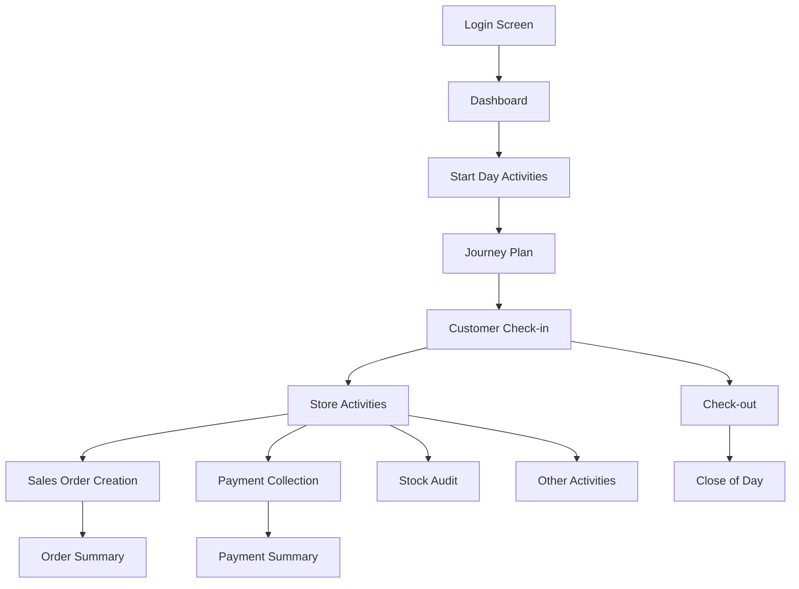

# WINIT Mobile Application - UI Designer Documentation

## Table of Contents
1. [Application Overview](#application-overview)
2. [Design System & Guidelines](#design-system--guidelines)
3. [Application Flow](#application-flow)
4. [Screen Inventory](#screen-inventory)
5. [Key User Journeys](#key-user-journeys)
6. [Component Library](#component-library)
7. [Screen-by-Screen Breakdown](#screen-by-screen-breakdown)

## Application Overview

WINIT Mobile is a comprehensive sales force automation (SFA) and distribution management system designed for field sales representatives. The application enables sales teams to manage their daily activities, customer interactions, orders, collections, and inventory management.

### Target Users
- Field Sales Representatives
- Sales Supervisors
- Delivery Personnel
- Merchandisers

### Key Features
- Customer Relationship Management
- Order Management (Sales, Returns, Purchase Orders)
- Payment Collection
- Journey Planning
- Stock Management
- Performance Tracking
- Activity Management

## Design System & Guidelines

### Color Palette
Based on the code analysis:
- **Primary Blue**: #1B478A (Used in headers, buttons)
- **Secondary Blue**: #24336B (Used for accents)
- **Success Green**: #3AC3A9, #99C796
- **Warning Orange**: #FF9728
- **Error Red**: #E74F48
- **Background**: #F5F5F5 (Light gray for main backgrounds)
- **White**: #FFFFFF (Cards, content areas)
- **Text Primary**: #333333
- **Text Secondary**: #555555

### Typography
- Headers: Bold, larger font sizes
- Body text: Regular weight
- Labels: Smaller font sizes, sometimes in secondary colors

### Layout Principles
- Mobile-first responsive design
- Card-based layouts for content organization
- Bottom navigation for primary actions
- Top navigation for contextual actions
- Floating action buttons for key activities

## Application Flow



## Screen Inventory

### 1. Authentication & Onboarding
- **Login Page** (`Index.razor`)
  - Mobile number input
  - Password field
  - Remember me checkbox
  - Language selection
  - Self-registration link

### 2. Core Navigation
- **Dashboard** (`DashBoard.razor`)
  - Coverage and productivity metrics
  - Task list
  - Attendance summary
  - Start Day button

### 3. Daily Activities
- **Start Day Prerequisites** (`Startday/StartdayPreRequisties.razor`)
  - Attendance marking
  - Message of the day
  - Odometer reading

- **Journey Plan** (`JourneyPlan/JourneyPlan.razor`)
  - Weekly calendar view
  - Route selection
  - Store list/map view toggle
  - Unplanned customers

### 4. Customer Management
- **My Customers** (`MyCustomer/Customer.razor`)
  - Customer list view
  - Search functionality
  - Filter options

- **Customer Details** (`Customer Details/CustomerDetails.razor`)
  - Comprehensive customer information
  - Multiple sub-sections for different details
  - Document management

- **Customer Check-in/out** (`CheckIn/CustomerCall.razor`)
  - Store information display
  - Timer for visit duration
  - Activity checklist

### 5. Sales Management
- **Create Sales Order** (`Sales/CreateSalesOrder.razor`)
  - Product search/scan
  - Grid/list view toggle
  - Product details with pricing
  - Promotions and discounts
  - Order summary footer

- **Sales Order Preview** (`Sales/SalesOrderPreview.razor`)
  - Order review
  - Edit capabilities
  - Place order action

- **Sales Order List** (`Sales/SalesOrderListView.razor`)
  - Historical orders
  - Status tracking
  - Filter and search

### 6. Payment & Collection
- **Collect Payment** (`Collection/CollectPayment.razor`)
  - Payment mode selection
  - Multi-currency support
  - Receipt generation

- **Payment Summary** (`Collection/PaymentSummary.razor`)
  - Daily collection overview
  - Payment breakdown

- **Cash Collection Deposit** (`Collection/CashCollectionDeposit/MaintainCashCollection.razor`)
  - Deposit request creation
  - Collection tracking

### 7. Inventory Management
- **Stock Audit** (`Stock Audit/StockAudit.razor`)
  - Physical stock verification
  - Variance reporting

- **View Van Stock** (`StoreTransactions/ViewVanStock/ViewVanStock.razor`)
  - Current inventory levels
  - Stock movement history

- **Load/Unload Request** (`LoadRequestM/`)
  - Stock requisition
  - Transfer management

### 8. Returns Management
- **Create Return Order** (`Return/CreateReturnOrder.razor`)
  - Return reason selection
  - Product selection
  - Return summary

- **Return Order List** (`Return/ReturnOrderListView.razor`)
  - Return history
  - Status tracking

### 9. Additional Features
- **Price Check** (`PriceCheck/PriceCheck.razor`)
  - Competitive pricing capture
  - Market intelligence

- **Product Feedback** (`ProductFeedback.razor`)
  - Customer feedback collection
  - Product ratings

- **Broadcast Initiative** (`BroadcastInitiative.razor`)
  - Marketing campaign execution
  - Initiative tracking

- **Planogram** (`Planogram/Planogram.razor`)
  - Shelf arrangement verification
  - Compliance checking

- **Store Check** (`StoreCheck/StoreCheck.razor`)
  - Store audit functionality
  - Compliance verification

### 10. Reports & Analytics
- **Dashboard Report** (`Reports/DashboardReport.razor`)
  - Performance metrics
  - Visual charts and graphs

### 11. Utilities & Settings
- **Settings** (`Settings.razor`)
  - App configuration
  - User preferences
  - Sync settings

- **Notification Handler** (`Notification/NotificationHandler.razor`)
  - Push notifications
  - Alert management

## Key User Journeys

### 1. Daily Sales Visit Flow
```
Login → Dashboard → Start Day → Journey Plan → Select Store → Check-in → 
Execute Activities (Sales Order, Collection, etc.) → Check-out → Next Store → 
End of Day → Close Day
```

### 2. Order Creation Flow
```
Customer Selection → Product Browse/Search → Add to Cart → Apply Promotions → 
Review Order → Confirm → Generate Invoice → Payment Collection (Optional)
```

### 3. Payment Collection Flow
```
Select Customer → View Outstanding → Select Invoices → Choose Payment Mode → 
Enter Amount → Confirm Collection → Print Receipt
```

## Component Library

### Common UI Components
1. **Headers**
   - Top navigation bar with back button
   - Title and subtitle support
   - Action buttons on the right

2. **Cards**
   - Information display cards
   - Interactive list item cards
   - Summary cards with metrics

3. **Forms**
   - Text inputs with floating labels
   - Dropdown selections
   - Date/time pickers
   - Number inputs with validation

4. **Buttons**
   - Primary action buttons (full width)
   - Secondary action buttons
   - Icon buttons
   - Floating action buttons

5. **Lists**
   - Searchable lists
   - Filterable lists
   - Infinite scroll support
   - Pull-to-refresh

6. **Modals/Popups**
   - Confirmation dialogs
   - Information popups
   - Form modals
   - Bottom sheets

7. **Navigation**
   - Tab navigation
   - Drawer navigation
   - Bottom navigation

## Screen-by-Screen Breakdown

### Login Screen
**Purpose**: User authentication
**Key Elements**:
- Logo placement (centered)
- Mobile number input field
- Password field with show/hide toggle
- Remember me checkbox
- Login button (primary CTA)
- Forgot password link
- Language selection
- Version information footer

**Design Considerations**:
- Clean, minimal design
- Focus on the login form
- Company branding prominent
- Clear error messaging

### Dashboard
**Purpose**: Daily overview and quick access to key functions
**Key Elements**:
- Coverage metrics cards
  - Total Assigned Stores
  - Total Covered Stores
- Task list with icons
  - Check-in/out
  - My Stores
  - Brand Training (expandable)
  - Customer Interaction (expandable)
  - Product Sampling
  - Escalation Matrix
  - ROTA
- Attendance summary card
- Start Day/Continue button (sticky footer)

**Design Considerations**:
- Information hierarchy
- Quick glanceable metrics
- Easy navigation to tasks
- Visual indicators for completed tasks

### Journey Plan
**Purpose**: Daily route planning and store visit management
**Key Elements**:
- Date selector (horizontal scroll)
- Route information header
- Toggle between map and list view
- Store cards with:
  - Store name and code
  - Address
  - Visit status indicator
  - Check-in button
- Unplanned customers option

**Design Considerations**:
- Calendar should be easily navigable
- Clear distinction between planned/unplanned
- Visual indicators for visit status
- Map integration for route optimization

### Create Sales Order
**Purpose**: Product selection and order creation
**Key Elements**:
- Search bar with barcode scanner
- View toggle (grid/list)
- Filter options
- Product cards/list items:
  - Product image
  - Name and code
  - Price information
  - Quantity selector
  - Add to cart button
- Order summary footer:
  - Line count
  - Total quantity
  - Order value
  - Discount applied
  - Place order button

**Design Considerations**:
- Easy product discovery
- Clear pricing information
- Visible cart summary
- Smooth add/edit experience
- Promotion indicators

### Customer Check-in Screen
**Purpose**: Track store visit activities
**Key Elements**:
- Store information header
- Check-in time display
- Running timer
- Activity checklist:
  - Sales Order
  - Payment Collection
  - Stock Audit
  - Other activities
- Completion indicators
- Check-out button

**Design Considerations**:
- Timer should be prominent
- Activity status clearly visible
- Easy navigation between activities
- Progress tracking

### Payment Collection
**Purpose**: Record customer payments
**Key Elements**:
- Customer information
- Outstanding amount display
- Invoice selection list
- Payment mode selection:
  - Cash
  - Cheque
  - Bank Transfer
  - Others
- Amount input
- Multi-currency support
- Receipt preview
- Collect button

**Design Considerations**:
- Clear outstanding visibility
- Easy invoice selection
- Payment mode icons
- Receipt generation

## Mobile-Specific Considerations

### Touch Targets
- Minimum 44x44px touch targets
- Adequate spacing between interactive elements
- Consider thumb reach zones

### Performance
- Lazy loading for lists
- Image optimization
- Offline capability indicators
- Sync status visibility

### Navigation
- Gesture support (swipe for back)
- Hardware back button handling
- Persistent bottom navigation
- Contextual actions in headers

### Forms
- Appropriate keyboard types
- Auto-advance between fields
- Clear validation messages
- Save draft functionality

### Offline Support
- Clear offline indicators
- Cached data access
- Queue for sync
- Conflict resolution UI

## Accessibility Guidelines
- High contrast ratios
- Clear focus indicators
- Screen reader support
- Scalable text
- Touch target sizes
- Error message clarity

## Platform Considerations
- iOS and Android design differences
- Platform-specific navigation patterns
- Native component usage where appropriate
- Consistent experience across platforms

---

This documentation provides a comprehensive overview of the WINIT Mobile application's UI requirements. Designers should use this as a foundation for creating mockups and prototypes, ensuring consistency across all screens while maintaining platform-specific best practices.